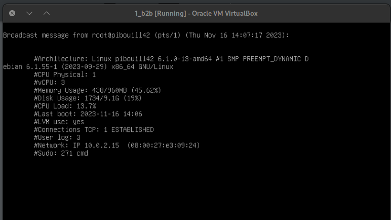
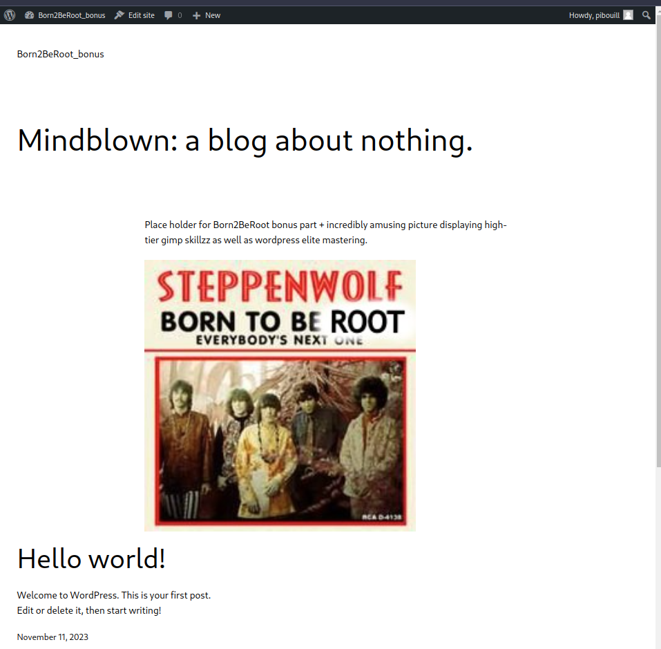
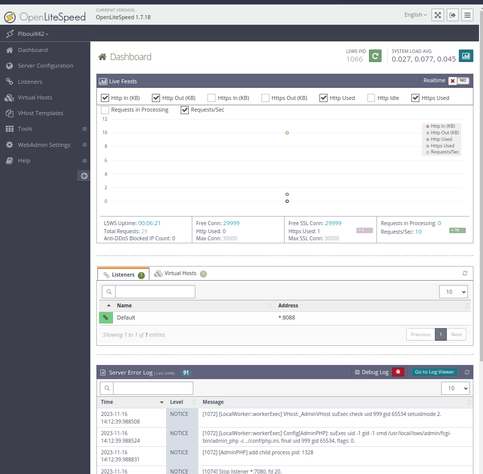

  

# Born2BeRoot

### Main part

>This project consists of having you set up your first server by following specific rules.

>You must choose as an operating system either the latest stable version of Debian (no
testing/unstable), or the latest stable version of Rocky. Debian is highly recommended
if you are new to system administration.
---
- Manual partition and setting up encrypted logical volumes

  

- SSH with UFW - enforcing strict rules
- Strong password policy (/etc/login.defs) and also with libpam-pwquality
- Configuring sudo usage, connection, password
- Creating a wall script running every 10mins from server startup with cron (see monitoring.sh)
  

  

---

### Bonus part

- Wordpress basic website set up with lighttpd, MariaDB and PHP
    

  

---
>Set up a service of your choice that you think is useful
- OpenLiteSpeed
  

  

