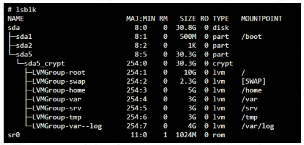

  

# Born2BeRoot

>This project consists of having you set up your first server by following specific rules.

>You must choose as an operating system either the latest stable version of Debian (no
testing/unstable), or the latest stable version of Rocky. Debian is highly recommended
if you are new to system administration.

  

